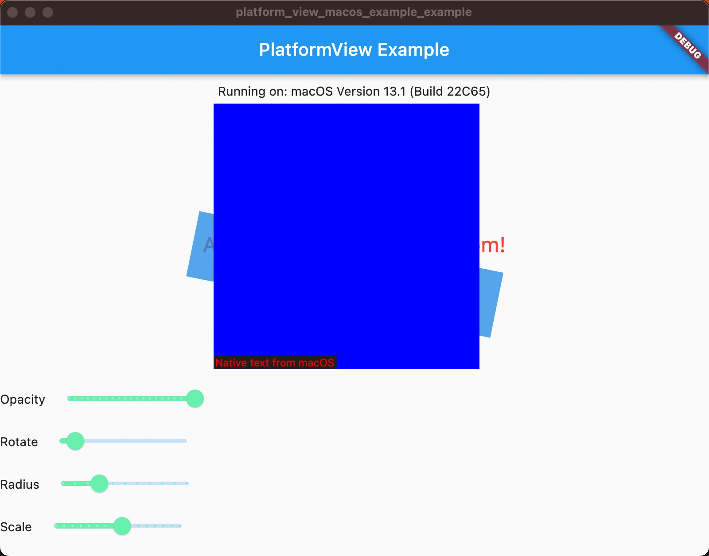
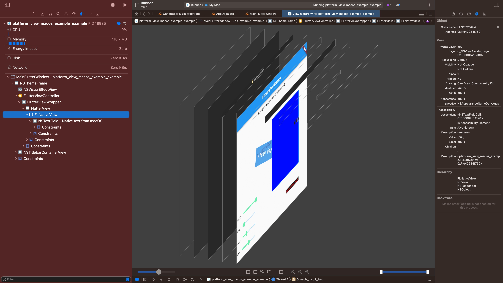

# platform_view_macos_example

Example for a simple macOS platform view.
1. `cd example`
2. `flutter run -d macos`

>
>Only basic functions are implemented, and translucency/rounded corners/scaling/rotation are not yet supported. The hierarchy of PlatformView and Flutter widget is also incorrect.

